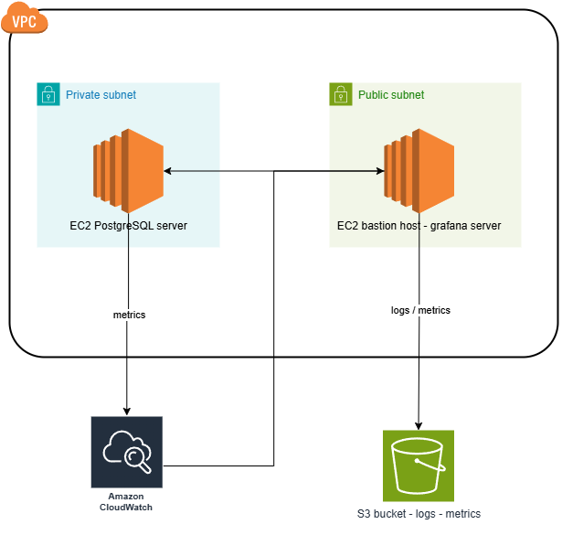

# ☁️ Reto Técnico - Night Watch
### AWS Architecture with Grafana Monitoring, PostgreSQL Server, Kubernetes (K3s), and S3 Logs

This project builds a simple but solid AWS infrastructure, including:
- A **Grafana server** (bastion host) to monitor resources
- A **PostgreSQL server** in a private subnet
- **Metrics and logs** exported daily to **Amazon S3**
- Infrastructure managed with **Terraform** (IaC)
- Basic **CloudWatch** monitoring
- Custom **scripts** for backups and metrics export

---

# Prerequisites

Before running the project, make sure you have:

- [Terraform](https://www.terraform.io/downloads) installed (tested on **Terraform v1.5+**)
- [AWS CLI](https://aws.amazon.com/cli/) configured locally (`aws configure`)
- An AWS account
- An **SSH key pair** (`.pem` file) for EC2 access
- An IAM user with the following permissions:

```json
{
  "Version": "2012-10-17",
  "Statement": [
    {
      "Effect": "Allow",
      "Action": [
        "ec2:*",
        "s3:*",
        "iam:*",
        "cloudwatch:*",
        "logs:*"
      ],
      "Resource": "*"
    }
  ]
}
```

---

# How to Deploy

1. **Clone** the repository:
   ```bash
   git clone https://github.com/javieralmeida30/Reto-Tecnico-Night-Watch.git
   ```

2. **Initialize Terraform**:
   ```bash
   terraform init
   ```

3. **Review the execution plan**:
   ```bash
   terraform plan
   ```

4. **Apply the infrastructure**:
   ```bash
   terraform apply
   ```

After a few minutes, Terraform will output:
- Bastion host **public IP**
- PostgreSQL server **private IP**
- **Grafana** access URL
- **S3 bucket** name for backups
Use the terraform command `terraform output` to export the outputs: terraform output > outputs.txt

---

# Infrastructure Architecture




 Components:
 - VPC: 10.0.0.0/16
 - Public Subnet: EC2 Bastion Host (Grafana) 
 - Private Subnet: EC2 PostgreSQL Server 
 - S3 Bucket: Stores logs and metrics 
 - CloudWatch: Monitors EC2 instances 
 - NAT Gateway: Internet access for private subnet 
 - Security Groups: Control access between instances 

---

#  Terraform Modules Structure

Modules:
- `vpc` Creates VPC, Subnets, NAT Gateway, Internet Gateway
- `ec2` Bastion host and private PostgreSQL EC2 
- `s3` Bucket for backups and metrics 
- `security_groups` Rules to control traffic between instances 
- `(Optional) route53`: Pre-configured module for future DNS assignment

Outputs:
- Public and private IPs
- Grafana access URL
- S3 bucket name

---

# Available Scripts

Scripts are located in `/scripts`:

Scripts:
- `grafana_user_data.sh`  User data for bastion EC2 (Docker + Grafana setup) 
- `postgres_user_data.sh`  User data for PostgreSQL EC2 (Docker + PostgreSQL setup) 
- `postgresql_daily_backup.sh`  Backs up PostgreSQL database daily to S3 
- `ec2_logs_to_s3.py`  Collects CloudWatch metrics and uploads to S3 
- `setup_scripts.sh`  Uploads scripts via SSH, deploys Nginx and Prometheus on Kubernetes, and configures backups

---

# Monitoring in Grafana

- Query the PostgreSQL server time:
  ```sql
  SELECT now() AS current_time;
  ```
- Monitor EC2 instance **CPU utilization** and **network metrics**.
- Create alerts inside Grafana.